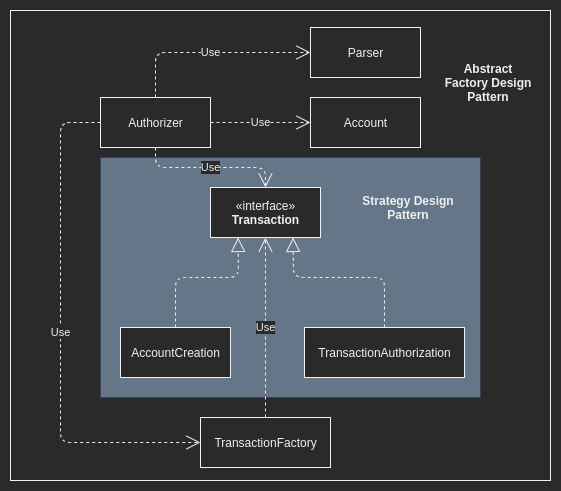

## Code Challenge: Authorizer

---

###  Technical and Architectural Decisions

I decided to use a mix from Strategy Design Pattern and Abstract Factory Design Pattern, to make the project more flexible to additional Transaction Types or additional Transaction violations.

The project has many classes to abstract functionalities in isolated classes. All classes are listed below:

*  Authorizer
* Account
* TransactionFactory
* Transaction
  * TransactionAuthorization
  * AccountCreation

The diagram showed below tries to explain relation and dependencies between classes:

For this project, I decided to code based on **Javascript** as Programming Language and **NodeJS** as Runtime. That decision was only for personal preferences.

### Dependencies

For this project is required to install on your local machine:

* NodeJS >= [14](https://nodejs.org/es/)
* NPM - *Usually installed with NodeJS*

### Getting Started

1. Set in project directory via command lin
2. Run `npm i`
3. Create a `.txt` file on project root with transactions lines.
4. Run `node index.js ${filename}.txt`

### Unit Test

If you want to run the unit tests, you can modify the `file.txt` placed on root project with whatever you want prove and run `npm test`.